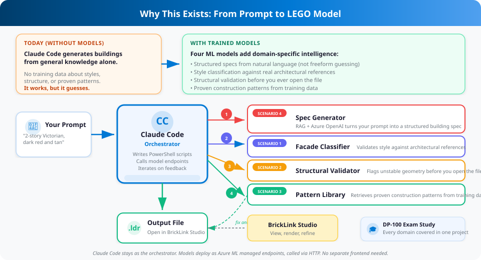
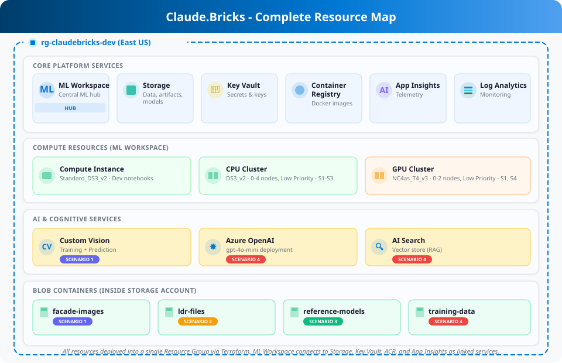

<div align="center">

# Claude.Bricks

**AI-Assisted Modular LEGO Design + Azure ML Infrastructure**

[](https://roccothefunnyman.github.io/Claude.Bricks/)
[](#-azure-ml-infrastructure)
[](#-4-ml-scenarios)
[](#-lego-design-workflow)

---

*Claude Code agents design modular LEGO buildings from natural language. An Azure ML platform handles facade classification, structural validation, pattern extraction, and LLM-powered spec generation. The whole thing doubles as a DP-100 exam study project.*

</div>

---

## Why This Exists

Claude Code can already generate LEGO buildings from a text description. You say "2-story Victorian townhouse, dark red and tan," and it writes a PowerShell script that produces a valid LDraw file. That works today.

The problem is that every design decision comes from Claude's general knowledge. It has no training data about which construction patterns actually produce stable models, which facade elements match which architectural styles, or what a "good" modular building even looks like structurally. It guesses, and sometimes it guesses wrong.

This project trains four ML models on real LEGO data to fill those gaps:

<div align="center">



</div>

The whole project also doubles as a study vehicle for the **DP-100 (Designing and Implementing a Data Science Solution on Azure)** certification exam. Every exam domain, from workspace provisioning to RAG pipelines, gets covered through one cohesive project instead of isolated toy examples.

> **[Read the full As-Built Documentation](https://roccothefunnyman.github.io/Claude.Bricks/)** for architecture details, deployment phases, and cost breakdown.

---

## 🏗 Azure ML Infrastructure

A single `terraform apply` provisions 15+ Azure resources into one Resource Group. Four independent ML scenarios run on top via Azure ML SDK v2, covering every major DP-100 exam domain in the process.

<div align="center">



</div>

### 🔬 4 ML Scenarios

| # | Scenario | What It Does | Technique | Key Services |
|:-:|----------|-------------|-----------|:-------------|
| **1** | Facade Classification | Identifies architectural style from rendered images | Random Forest | Custom Vision, Managed Endpoint |
| **2** | Structural Validation | Flags unstable or malformed .ldr geometry | Isolation Forest | MLflow, Online Endpoint |
| **3** | Pattern Extraction | Clusters proven construction patterns from training data | KMeans / HDBSCAN | Pipeline Jobs, MLflow |
| **4** | Spec Generator | Turns natural language into structured building specs | RAG + Azure OpenAI | AI Search, Prompt Flow |

### 📦 Deployment Phases

```
Phase 1              Phase 2             Phase 3-6
Terraform       -->  Bootstrap      -->  ML Scenarios (independent, any order)
5-15 min             ~2 min              ~30-45 min each

15 Azure             Compute,            Train, evaluate, deploy,
resources            datastores,         score per scenario
provisioned          environments
```

---

## 🧱 LEGO Design Workflow

You describe what you want, Claude generates a PowerShell script, the script outputs an LDraw (.ldr) file, and you open it in BrickLink Studio to view, render, and refine.

### Prerequisites

| Tool | Purpose |
|------|---------|
| **[BrickLink Studio](https://www.bricklink.com/v3/studio/download.page)** | View and render .ldr files |
| **PowerShell 5.1+** | Included with Windows 10/11 |
| **Claude Code CLI** | AI-assisted design sessions |

### Quick Start

```
1.  Open a terminal in this folder
2.  Run `claude`
3.  Describe the building you want:
      "Design a 2-story Victorian townhouse, 32x16 studs, dark red and tan with white trim"
4.  Claude generates a PowerShell script in scripts/
5.  The script runs and produces an .ldr file in output/
6.  Open the .ldr file in BrickLink Studio
```

### Why PowerShell Scripts?

A detailed LEGO building can be 1,000-3,000+ lines of LDraw code. Writing that directly would exceed Claude's output token limit. Instead, Claude writes a compact PowerShell script (~300-600 lines) with helper functions that procedurally generate the full .ldr file.

### Multi-Agent Workflow

For complex buildings, Claude spawns a team of specialized agents:

| Agent | Role | When Used |
|-------|------|-----------|
| **Reference Analyzer** | One agent per .ldr file, all in parallel. Reads in chunks, extracts patterns, returns structured summary. | When you provide reference files |
| **Architect** | Designs building layout, dimensions, openings, colors | Every new building |
| **Script Writer** | Writes the PowerShell generation script | After design is approved |
| **Validator** | Checks the output .ldr for structural errors | After generation |

---

## 📁 Repository Structure

```
Claude.Bricks/
├── CLAUDE.md                 # Claude Code session context
├── README.md                 # This file
├── docs/
│   └── index.html            # As-Built document (GitHub Pages)
├── deploymentcode/           # Azure ML deployment scripts
│   ├── infrastructure/       # Terraform configs
│   ├── bootstrap/            # Post-Terraform setup (SDK v2)
│   ├── scenarios/            # ML scenario implementations (1-4)
│   └── data/                 # Training data per scenario
├── standards/                # LDraw format and building conventions
│   ├── ldraw-format.md
│   ├── modular-building-spec.md
│   ├── parts-catalog.md
│   ├── color-palette.md
│   └── architectural-patterns.md
├── scripts/                  # PowerShell LEGO generation scripts
├── output/                   # Generated .ldr files
├── reference/                # Reference .ldr files for analysis
├── modules/                  # Shared PowerShell module (LDraw.psm1)
└── azure-icons/              # Azure SVG icons for documentation
```

## 📎 Adding Reference Files

Drop any well-built .ldr files into `reference/` and ask Claude to analyze them:

> "Analyze the reference files in reference/"

Claude spawns **one Explore agent per file, all running in parallel**. Each agent reads its file in 500-line chunks and returns a structured summary covering dimensions, parts, colors, construction patterns, and architectural details.

## 💡 Tips

- **Be specific about style**: "Victorian with ornate cornice" works better than "nice building"
- **Specify dimensions**: "32x16 studs, 2 stories" gives Claude clear constraints
- **Name your colors**: "Dark red primary, tan secondary, white trim" maps directly to LDraw color codes
- **Iterate**: Open the .ldr in stud.io, identify issues, then ask Claude to adjust

---

<div align="center">

**[View Full As-Built Documentation](https://roccothefunnyman.github.io/Claude.Bricks/)**

*Built with Claude Code + Terraform + Azure ML SDK v2*

</div>
