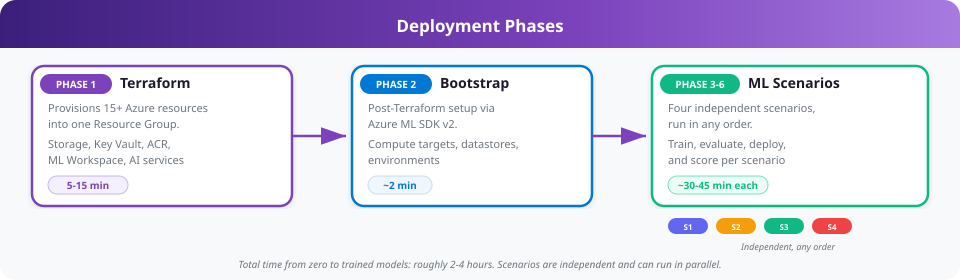
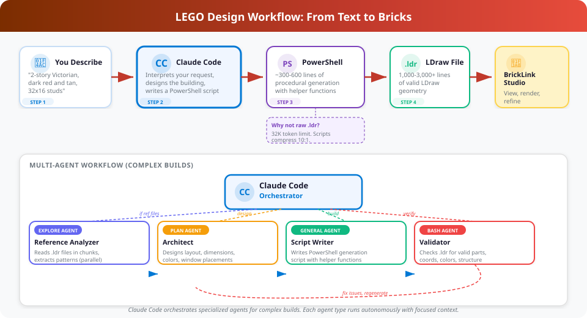

<div align="center">

# Claude.Bricks

**AI-Assisted Modular LEGO Design + Azure ML Infrastructure**

[](https://roccothefunnyman.github.io/Claude.Bricks/)
[](#-azure-ml-infrastructure)
[](#-cicd-pipelines)
[](#-4-ml-scenarios)
[](#-lego-design-workflow)

---

*Claude Code agents design modular LEGO buildings from natural language. An Azure ML platform handles facade classification, structural validation, pattern extraction, and LLM-powered spec generation. The project covers all five AI-300 exam domains through one cohesive build.*

</div>

---

## Why This Exists

Claude Code can already generate LEGO buildings from a text description. You say "2-story Victorian townhouse, dark red and tan," and it writes a PowerShell script that produces a valid LDraw file. That works today.

The problem is that every design decision comes from Claude's general knowledge. It has no training data about which construction patterns actually produce stable models, which facade elements match which architectural styles, or what a "good" modular building even looks like structurally. It guesses, and sometimes it guesses wrong.

This project trains four ML models on real LEGO data to fill those gaps:

<div align="center">


</div>

The project also serves as a study vehicle for the **AI-300 (Designing and Implementing Enterprise Azure AI Solutions)** certification exam. Every exam domain gets covered through one real project instead of isolated toy examples:

| Domain | Weight | Where It Shows Up |
|--------|:------:|-------------------|
| MLOps Infrastructure | 15-20% | Bicep IaC, compute provisioning, RBAC, networking |
| ML Model Lifecycle | 25-30% | Training pipelines, MLflow tracking, blue/green deployment, drift detection |
| GenAIOps Infrastructure | 20-25% | AI Foundry hub/project, prompt versioning, RAG pipeline |
| GenAI Quality Assurance | 10-15% | Evaluation framework, 6 quality metrics, threshold gates |
| GenAI Optimization | 10-15% | Few-shot tuning, RAG chunking experiments, prompt iteration |

> **[Read the full As-Built Documentation](https://roccothefunnyman.github.io/Claude.Bricks/)** for architecture details, deployment phases, and cost breakdown.

---

## Azure ML Infrastructure

Bicep templates provision 15+ Azure resources into one Resource Group. A single `az deployment group create` (or the GitHub Actions infra workflow) stands up everything. Terraform templates are kept in `tf/` as an alternative path.

<div align="center">


</div>

### Bicep Modules (16)

The `deploymentcode/bicep/` directory contains a `main.bicep` orchestrator that calls 15 child modules:

| Module | Resources |
|--------|-----------|
| `storage` | Storage Account (blob, ADLS) |
| `keyvault` | Key Vault with RBAC access policies |
| `acr` | Azure Container Registry |
| `log-analytics` | Log Analytics workspace |
| `app-insights` | Application Insights (connected to Log Analytics) |
| `aml-workspace` | Azure ML workspace |
| `aml-compute` | Compute clusters and instances |
| `cognitive-services` | Azure OpenAI (GPT-4o, text-embedding-3-large) |
| `search` | AI Search (semantic + vector) |
| `foundry-hub` | AI Foundry Hub |
| `foundry-project` | AI Foundry Project |
| `aml-registry` | Cross-workspace model registry |
| `rbac` | Role assignments (workspace identity, OIDC SP) |
| `vnet` | VNet, subnets, NSGs |
| `private-endpoint` | Private endpoints for workspace, storage, ACR |

Environment parameters live in `deploymentcode/bicep/parameters/` (dev.bicepparam, test.bicepparam).

### 4 ML Scenarios

| # | Scenario | What It Does | Technique | Key Services |
|:-:|----------|-------------|-----------|:-------------|
| **1** | Facade Classification | Identifies architectural style from rendered images | Random Forest | Managed Endpoint, blue/green canary deployment |
| **2** | Structural Validation | Flags unstable or malformed .ldr geometry | Isolation Forest | MLflow, Online Endpoint |
| **3** | Pattern Extraction | Clusters proven construction patterns from training data | KMeans / HDBSCAN | Pipeline Jobs, MLflow |
| **4** | Spec Generator | Turns natural language into structured building specs | RAG + Azure OpenAI | AI Search, AI Foundry, Prompt Flow |

### Deployment Phases

<div align="center">



</div>

---

## CI/CD Pipelines

Five GitHub Actions workflows automate the full lifecycle. All use OIDC federated credentials (no stored secrets).

| Workflow | Trigger | What It Does |
|----------|---------|-------------|
| `infra.yml` | Push to `deploymentcode/bicep/**` | Runs `az bicep build`, what-if, then deploys |
| `train.yml` | Push to `deploymentcode/scripts/scenario[1-3]/**` | Submits AML pipeline jobs for training |
| `deploy-model.yml` | Manual / after train | Blue/green canary deploy with smoke tests |
| `eval-rag.yml` | Push to `eval/**` or `prompts/**` | Runs RAG evaluation, checks quality thresholds |
| `drift-check.yml` | Cron (weekly) | Computes PSI/KS/JS drift metrics, triggers retrain if needed |

---

## LEGO Design Workflow

You describe what you want, Claude generates a PowerShell script, the script outputs an LDraw (.ldr) file, and you open it in BrickLink Studio to view, render, and refine.

<div align="center">



</div>

### Prerequisites

| Tool | Purpose |
|------|---------|
| **[BrickLink Studio](https://www.bricklink.com/v3/studio/download.page)** | View and render .ldr files |
| **PowerShell 5.1+** | Included with Windows 10/11 |
| **Claude Code CLI** | AI-assisted design sessions |

### Quick Start

```
1.  Open a terminal in this folder
2.  Run `claude`
3.  Describe the building you want:
      "Design a 2-story Victorian townhouse, 32x16 studs, dark red and tan with white trim"
4.  Claude generates a PowerShell script in scripts/
5.  The script runs and produces an .ldr file in output/
6.  Open the .ldr file in BrickLink Studio
```

### Why PowerShell Scripts?

A detailed LEGO building can be 1,000-3,000+ lines of LDraw code. Writing that directly would exceed Claude's output token limit. Instead, Claude writes a compact PowerShell script (~300-600 lines) with helper functions that procedurally generate the full .ldr file.

### Multi-Agent Workflow

For complex buildings, Claude spawns a team of specialized agents:

| Agent | Role | When Used |
|-------|------|-----------|
| **Reference Analyzer** | One agent per .ldr file, all in parallel. Reads in chunks, extracts patterns, returns structured summary. | When you provide reference files |
| **Architect** | Designs building layout, dimensions, openings, colors | Every new building |
| **Script Writer** | Writes the PowerShell generation script | After design is approved |
| **Validator** | Checks the output .ldr for structural errors | After generation |

---

## Repository Structure

```
Claude.Bricks/
  .github/workflows/         # 5 GitHub Actions workflows (infra, train, deploy, eval, drift)
  deploymentcode/
    bicep/                    # Bicep IaC (main.bicep + 15 modules + parameters)
    scripts/
      common/                 # Shared utilities (ml_client.py, telemetry.py)
      scenario1/              # Facade classifier (train, deploy, canary, rollback, smoke test)
      scenario2/              # Structural validator
      scenario3/              # Pattern extractor
      scenario4/              # Spec generator + foundry/ (Foundry project setup, eval, monitoring)
      register_*.py           # Asset registration (data, components, environments)
      publish_to_registry.py  # Cross-workspace registry publishing
      promote_model.py        # Dev-to-test model promotion
  eval/                       # Evaluation framework (datasets, configs, evaluators, runners)
  prompts/                    # Versioned prompts (system/, rag/, few-shot/, CHANGELOG.md)
  monitoring/                 # Drift detection, feedback analysis, KQL dashboards
  runbooks/                   # Operational runbooks (endpoint-deployment, asset-lifecycle)
  scripts/                    # PowerShell LEGO generation scripts
  modules/                    # Shared PowerShell LDraw module (LDraw.psm1)
  output/                     # Generated .ldr files (gitignored)
  reference/                  # Reference .ldr files for analysis (gitignored)
  standards/                  # LDraw standards docs (parts, colors, patterns)
  docs/                       # SVG diagrams for README and as-built
  tf/                         # Terraform templates (alternative IaC path)
  archive/                    # Archived planning documents
```

## Adding Reference Files

Drop any well-built .ldr files into `reference/` and ask Claude to analyze them:

> "Analyze the reference files in reference/"

Claude spawns **one Explore agent per file, all running in parallel**. Each agent reads its file in 500-line chunks and returns a structured summary covering dimensions, parts, colors, construction patterns, and architectural details.

## Tips

- **Be specific about style**: "Victorian with ornate cornice" works better than "nice building"
- **Specify dimensions**: "32x16 studs, 2 stories" gives Claude clear constraints
- **Name your colors**: "Dark red primary, tan secondary, white trim" maps directly to LDraw color codes
- **Iterate**: Open the .ldr in stud.io, identify issues, then ask Claude to adjust

---

<div align="center">

**[View Full As-Built Documentation](https://roccothefunnyman.github.io/Claude.Bricks/)**

*Built with Claude Code + Bicep + Azure ML SDK v2 + GitHub Actions*

</div>
